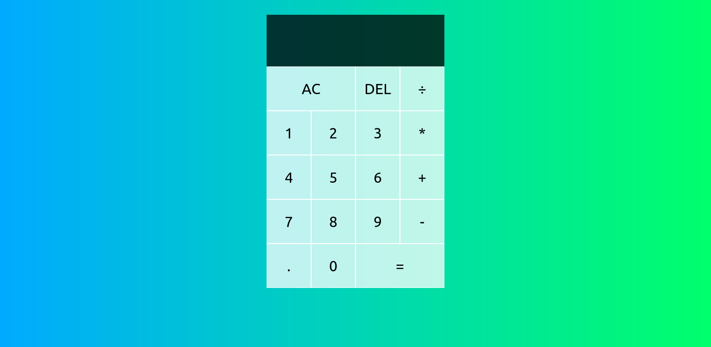

# Calculator App

This is a simple calculator app developed using React and CSS. It provides basic arithmetic operations and a user-friendly interface for performing calculations.

## Features

- Addition, subtraction, multiplication, and division operations.
- Clear button to reset the current calculation.
- Responsive design for various screen sizes.
- Error handling for invalid calculations.

## Demo

You can try out the live demo of the Calculator App [here](https://your-demo-link.com).

